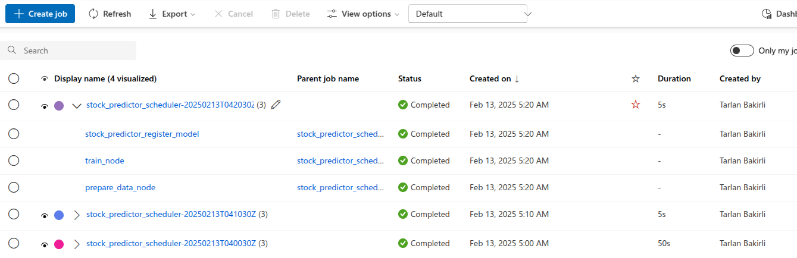
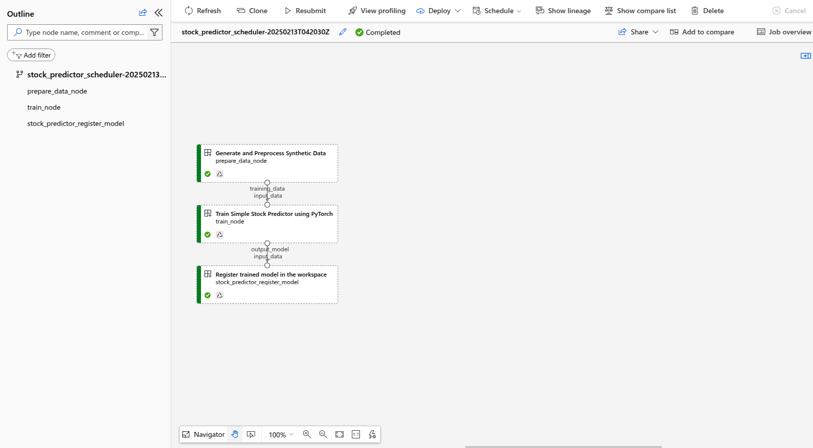

# Documentation

Mini-project documentation is demonstrated with 3 main headers: **Standalone training pipeline, Pipeline with Scheduler and Prediction**

## 1 - Standalone training pipeline

single_training.ipynb contains procedures to start standalone training. Code for data preparation and training is separate implementation than pipeline with scheduler which is described below. This notebook allows to start training job manually whenever debugging or development is required.
Notebook contains custom environment creation from Docker context. This custom environment is used within job execution which provides required libraries such as torch.

## 2 - Pipeline with Scheduler

Pipeline is defined in the pipeline.py script.
There is a pipeline created and attached to a scheduler which triggers that pipeline job to run every day.
Pipeline consists of 3 components:
* Data preparation
* Training
* Model Registration

Following image shows jobs executed in 10 minutes interval (for testing purposes):


Following image shows diagram view of the pipeline:


Each component corresponds to AzureML component, so they are decoupled allowing to be exploited in different scenarios. For example, new data preparation component can be created and used with existing training component. Each component has its own environment defined in conda file. It is requirement
by the AzureML pipeline. It allows to specify libraries to run that component.

Each component is briefly described below:

### Data Preparation

Data prepararation is responsible for generating synthetic timeseries data and preprocessing it. This data is first normalized, then splitted into chunks for training and then splitted into train and test splits. Then saves data into numpy arrays and outputs filepath.

### Training

Training takes input path for data from Data Preparation and runs model training. Simple torch MLP model is used. Then optimized model is saved and path is
returned as output.

### Registering Model

This component takes input path for optimized model from Training and registers the model to AzureML workspace.

To run pipeline, python environment with relevant libraries need to be installed. It must contain AzureML SDKv2 and some other libraries which is used within pipeline script and component scripts.

To run pipeline with scheduler:
```
python pipeline.py
```

## 3 - Prediction

predict.py script contains logic to load registered model in AzureML workspace and make predictions and visualize those predictions.

To run prediction:
```
python predict.py --model_name pipeline_stock_predictor --model_version 2 --previous_time_window 10 --next_time_window 5 --vis

--previous_time_window: shows chunk size to train on.
--next_time_window: shows next how many days to predict
```

Example prediction output can be found in visuals directory.


## Future Considerations

* Deploying registered model on a AzureML managed enpoint for public inferencing.
* Doing evaluation on the trained model and register model if score is larger than threshold.